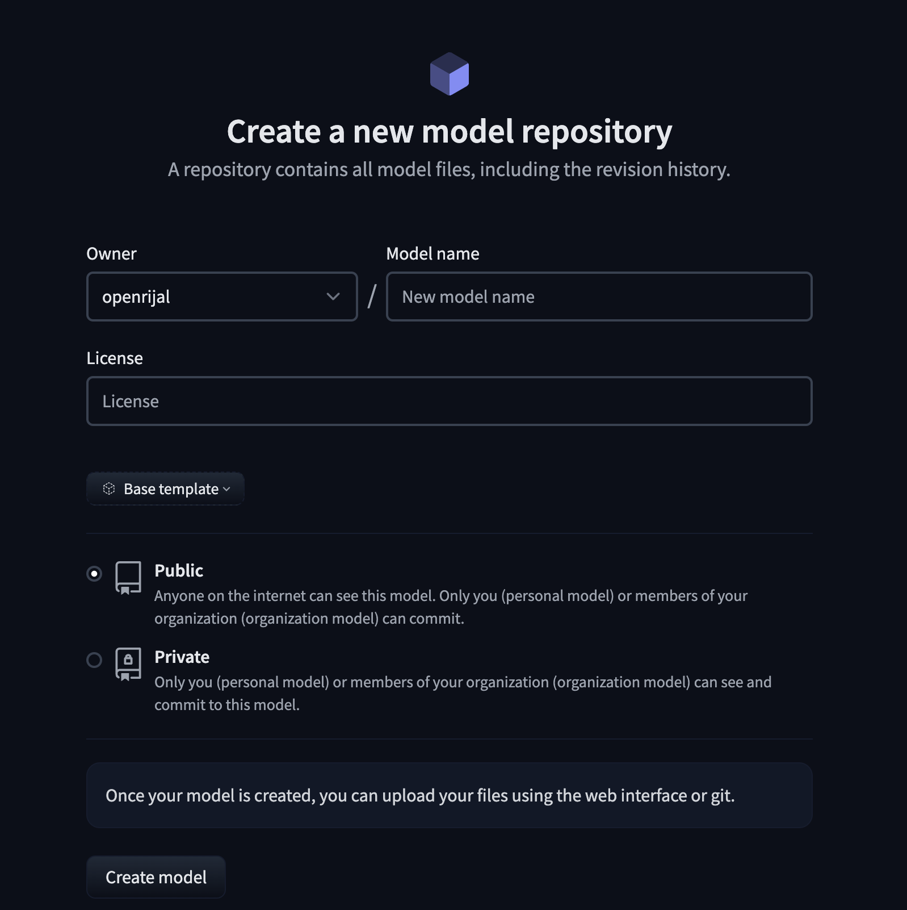
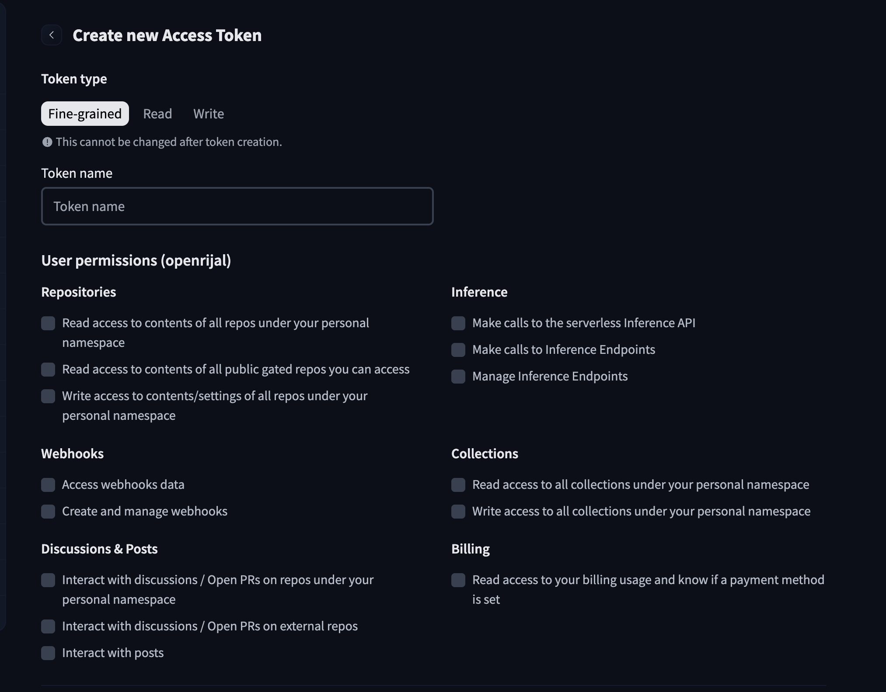
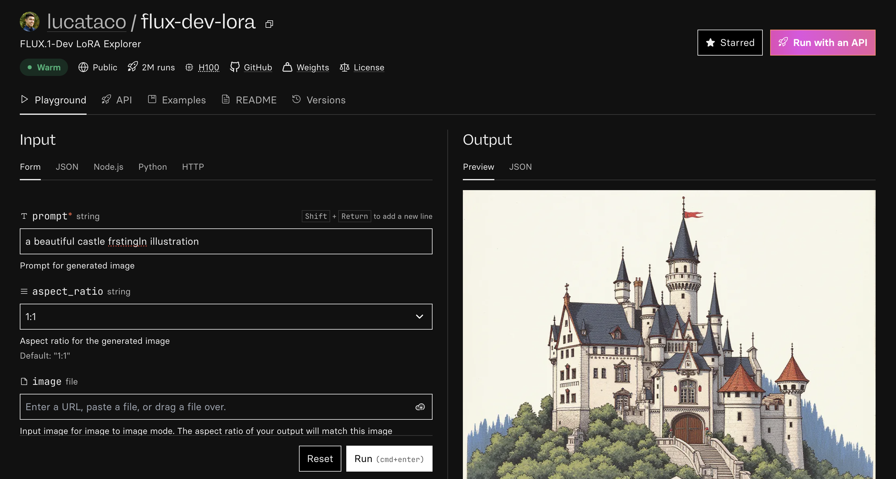
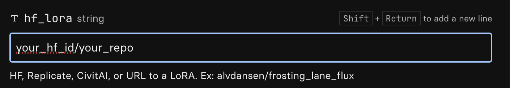

# Introduction

## LoRA: A Powerful Tool for Realistic Image Generation
LoRA (Low-Rank Adaptation) models are a type of fine-tuning technique that allows for efficient adaptation of pre-trained large language models (LLMs) to specific tasks or datasets.  They achieve this by adding small, trainable matrices to the existing network weights, minimizing the computational cost and storage requirements associated with full fine-tuning. This makes them ideal for generating high-quality images with relatively modest computational resources.  In this tutorial, we'll explore how to train a LoRA model to generate realistic images of people using their real pictures.

### Goal: Generating Realistic Images from Real Pictures
Our goal is to train a LoRA model to create realistic images of individuals based on their actual photographs. This process involves using a dataset of real-life images, converting them into a suitable format for training, and then using the trained LoRA model to generate new images of those individuals with varied poses, expressions, and styles.

### Dataset Preparation: The Foundation for Success
Preparing the dataset is crucial for successful LoRA training.  The process typically involves gathering a diverse set of high-quality images of the target individuals, ensuring consistency in lighting and resolution. These images will be used to train our LoRA model, and therefore the quality and diversity of the dataset directly influence the quality of generated images.

# Implementation Plan

## Pre-requisites
This blog focuses on utilizing cloud resources for image training and generation. While local replication of this process may be feasible, accessibility to the necessary computational resources can be a limiting factor. Furthermore, the tools presented herein offer a user-friendly interface, abstracting away the complexities of local setup which often demands significant technical expertise.

Please create a free account on these platforms beforehand, we will need it soon.
- [Huggingface](https://huggingface.co/)
- [Replicate](https://replicate.com/)

> While these platforms offer free accounts, model training incurs costs due to the utilization of platform-provided processing power (GPUs). In my experiment, training the model on 50 images resulted in an approximate cost of 3.50 USD.

## Prepare your Dataset
The dataset preparation process is relatively straightforward. You will need a collection of high-resolution images of the individual you intend to generate. **It is crucial to obtain explicit consent from the individual before using their images for this purpose.** For the demonstration in this blog post, I will be using my own pictures as the dataset, enabling me to generate personalized images using this technique.

I have compiled a dataset consisting of 50 photographs of myself, captured in various settings, angles, and lighting conditions to ensure diversity. Once you have assembled your images, please organize them within a folder and create a zip archive of the folder. With this step completed, your dataset is ready for the subsequent stages of the process.

## Start Training the Model
I used [this pre-made interface](https://replicate.com/ostris/flux-dev-lora-trainer/train) on Replicate to train the model. This step needs to be done carefully, this is the majority of the configuration required.

### Destination
Click the dropdown and create destination to be used to store this model on Replicate.

### Input Images
This is the zip from `Prepare your Dataset` step earlier. Please upload the zip file here.

### Trigger Word
This is where you choose a word to act as a trigger to recall this particular dataset. You will need to use this word in your prompt to generate the image based on the dataset you uploaded and trained the model on.
- Example Trigger Word: `jabba`
- Example Prompt: `a portrait of jabba at a green grass field around wild bisons on Tatooine`

### Auto Caption
If you check this box, the images you've uploaded will be captioned automatically using [Llava](https://huggingface.co/docs/transformers/en/model_doc/llava) model.

> Alternatively, you may choose to provide your own captions on the images you uploaded. To provide your own caption create a txt file of the same name as your image.

### hf_repo_id
This is the huggingface repo where the trained model will be stored.
- Head over to [Huggingface](https://huggingface.co/)
- Click on [Profile > New Model](https://huggingface.co/new) to create this repo.

- You may name the model anything you like. 
> To avoid futher configuration around access during image generation, please make the model public. You can later make it private if you wish.
- Copy the repo id and paste it on the `hf_repo_id` field in the replicate interface.

### hf_token
This is the huggingface token, to be able to programatically upload model to Huggingface.
- Head over to [Huggingface](https://huggingface.co/)
- Click on [Profile > Access Token > Create New Token](hhttps://huggingface.co/settings/tokens) to create this repo.

- You may name the token anything you like. 
> You can only see this token once, so please copy and store this in a safe place for later.
- Copy the token and paste it on the `hf_token` field in the replicate interface.

Now click `Create training` to begin training. 
> This will take some time depending on the resource and files. In my case it took me around 30 mins to complete training.

Once training is complete, you will see a messsage indicating that, and you can also see the output files in the huggingface repo you created earlier. This trained model can now be used to generate any number images.

## Generate Images
I used [this other pre-made interface](https://replicate.com/lucataco/flux-dev-lora) on Replicate to generate my images.

### prompt
This is the prompt that is used for generating the image. Remember that this prompt needs to contain your trigger word, only then the model can generate images that you trained it with. 

For example, if you trained the model on images of [Jabba the Hutt](https://en.wikipedia.org/wiki/Jabba_the_Hutt) from Starwars.
- Example Trigger Word: `jabba`
- Example Prompt: `a portrait of jabba at a green grass field around wild bisons on Tatooine`

### hf_lora
Change this field to your huggingface repo id you created earlier.

### num_outputs
Change this field to generate multiple outputs (Max 4). Remember each output will cost you some money.

Now click `Run` to begin training. 
> This will take some time depending on the resource and files. In my case it took me around 30 mins to complete training.

> In my experiment, generating an image resulted in an approximate cost of 0.04 USD per image.

## Sample Images

- prompt: `a professional portrait of <trigger_word> at a conference in a formal attire`

- prompt: `a headshot of <trigger_word> at thanksgiving parade wearing a turkey hat`

- prompt: `photo of <trigger_word> cycling at tour de france 

## Conclusion
I was honestly impressed by the outputs. The first two samples were pretty impressive and resemble me a lot. I even replaced my existing LinkedIn display picture with it. The last sample for Tour de France does not look like me at all.

I also felt like it was a decent cost for me to experiment and learn something new for under $5 in total.

I do wanna thank all the companies and developers who have put efforts around not only building the open source models like [Flux](https://flux1ai.com/models), but also the interfaces and options to very easily try them.