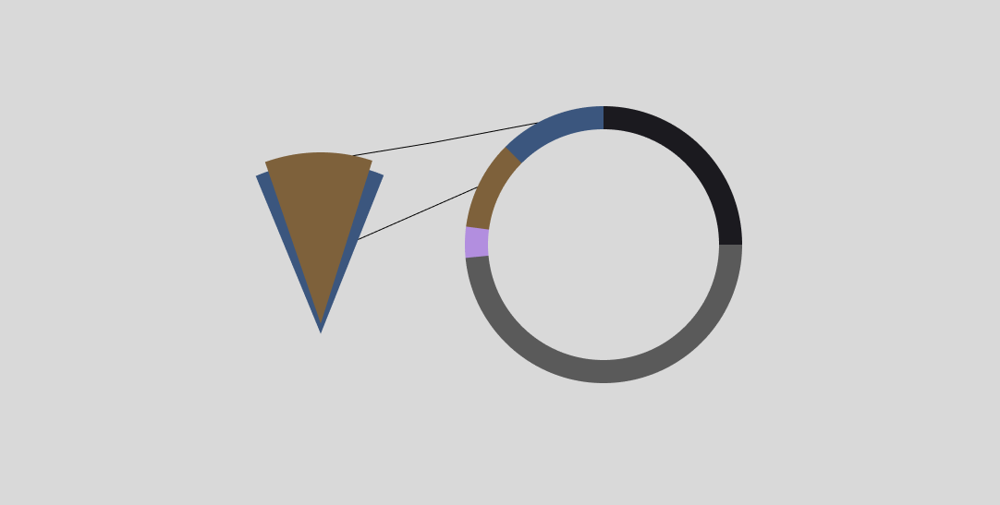

Pie and donut charts have gained a lot of reputation in the visualization world because they just look cool! However, unfortunately, the wrong usage of them may lead to misleading data representation. In this article, we will delve into the shortcomings and limitations of these tools.

---

# Limited Comparison Capability

In fact, the human eye often struggles to distinguish small variations in slice sizes, especially when dealing with numerous categories. Forcing your audience to extract meaningful insights from a crowded radial chart can be a challenging process that may lead to misinformation.

---

# Misleading representation

As mentioned earlier, the human eye's difficulty in distinguishing between radial areas can lead to potential confusion for your audience. When working with such a visualization tool, it's crucial to ensure that all slice areas are easily distinguishable even without labels.

The figure above represents the same value, 25%. Take notice of how your eyes perceive the perfect 25% or the 90-degree angle on the left.

----

# Conclusion

In the end of the day, pie and donut charts aren't that bad. They do have their merits. Their aesthetic appeal [look cool!], and they can be effective when used to compare only two categories or to represent a ratio of something.