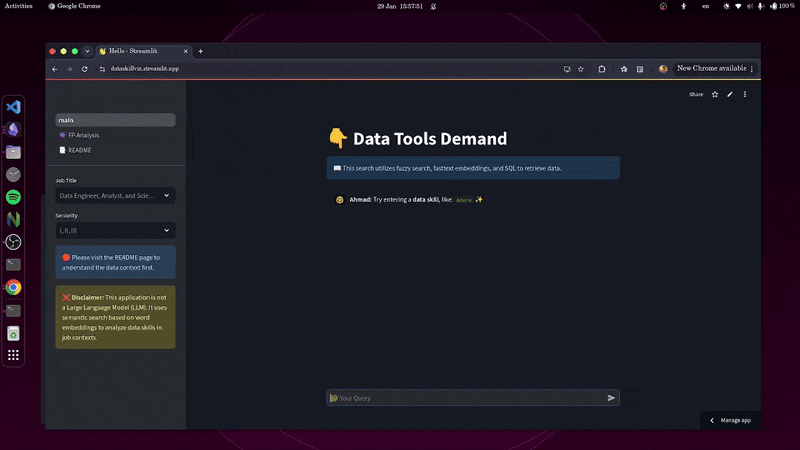

In a world full of data tools that solve the same problem with different approaches, it’s crucial to know how far you are from market requirements from a tech tools perspective.

> For me, the founder of this project, I believe that technology doesn’t define a good engineer. Skills that make them stand out from the crowd are critical thinking, deep fundamental knowledge, adaptability, communication through noisy channels, understanding business needs, and the ability to deliver cheap, effective, simple, but powerful solutions.

Unfortunately, recruiters don’t have the time to discover these traits in every single candidate; they often filter candidates based on their toolkit first, then test their fundamentals and personal traits during the hiring process.

The main reason I think juniors are held back from landing a job quickly is the resume. You can’t fit every single unique trait about yourself on one page. Recruiters often use software to filter massive amounts of resumes (which is a bad idea—looking for you guys to come up with something innovative to solve this problem), and it’s hard to discover tool demand patterns manually.

> Tools come and go, but fundamentals remain timeless.  
> **LONG LIVE SQL, LONG LIVE SCIENCE!**

### Understanding The Engineering-Recrutment Conflict
Before thinking about a product that might fix the system, let’s take a quick look at the comparison between engineers' and recruiters' mindsets.

| **Engineers**                                         | **Recruiters**                                    |
|-------------------------------------------------------|---------------------------------------------------|
| **Prefer to be tool-agnostic**                        | **Prefer a candidate who can hit the ground running** |
| Engineers value **problem-solving** over tool proficiency, focusing on solving the project’s core issue with minimal reliance on specific tools. | Recruiters typically favor candidates who already have the skills and tools required for the job, reducing the need for onboarding. |
| **Focus on the project’s problem and solution**       | **Focus on the quantitative impact of the project** |
| Engineers prioritize understanding the problem and creating effective solutions, regardless of the tool used. | Recruiters often look for candidates who can contribute immediately and show measurable impact quickly. |
| **Find learning every single tool overkill**          | **Look for candidates with a wide toolset, especially for juniors** |
| Engineers believe in mastering core concepts rather than chasing every new tool, as many tools become outdated quickly. | Recruiters tend to favor candidates with a broad toolbox, particularly for junior roles, to signal adaptability and readiness. |
| **Value fundamentals over tools**                     | **Value specific, marketable skills**             |
| Engineers argue that deep, fundamental knowledge remains more important than knowing the latest tools, which can often be picked up on the job. | Recruiters tend to prioritize candidates with skills directly matching the role's requirements, based on current tool trends. |

### Project Features

`DataSkillViz` collects over `400` data-relevent tools and over `40,000` data job postings to perform:
-  **Tool Demand Analysis**, which provides insights into the prevalence of specific tools in job postings in addition to other sementicly relvent tool, helping users understand where to focus their learning. 
-  **Association Graph**, uncovers co-occurring tools, offering a deeper view into how technologies complement one another in real-world roles.

### Motivation
During the beginning of my data journey, I discovered <a href="https://datanerd.tech" target="_blank">Data Nerd</a> by  <a href="https://www.lukebarousse.com" target="_blank">Luke Burrose</a>. I was amazed that we can practically build something like that! After more than a year, I decided to bring my skills to the table and come up with the `thing` I thought I needed the most on top of Luke’s public data.

> I am tired of clickbait content about the "tool/skill that will land you a job." I learned how to code when I was a 16-year-old teen; The real bottleneck? Passing the resume screening software. Do that first, then showcase your skills during the interview.

Recruiters  have no time to stop and think about how cool your project is. They care about keywords and phrases that make them think you are a great fit for the job description.

For these reasons, I came up with this project to see what combination of tools are the most popular, in addition to check the rank of your skillset in the market.

> Fortunatly, Some companies recognized the vast potential wasted by the old automatic resume-screening approach and sought to advance with tech-based solutions to measure how well a candidate fits their requirements before any human interaction, such as technical and IQ assessments.  

### How I Brought My Idea to Light
Kimball data modeling (yes, it’s still relevant!), basic statistics, a simple Postgres database, and old-school fastText embeddings. Combine these with a clean pipeline, thorough testing, and some wisdom to bake these ingredients together to deliver a functional data product!

Don't believe me? The project is open-sourced; check the <a href="https://github.com/ahmadMuhammadGd/skillVector-streamlit" target="_blank">code</a> yourself!

<!-- ### Resources I Found Useful in This Topic
- [Ergest Xheblati, Learn Things That Don't Change](https://sqlpatterns.com/p/learn-things-that-dont-change?utm_source=publication-search)
- [Ralph Kimball, The Data Warehouse Toolkit](https://www.kimballgroup.com/data-warehouse-business-intelligence-resources/books/data-warehouse-dw-toolkit/)
- [Understanding ETL by O’Reilly](https://www.databricks.com/resources/ebook/understanding-etl)
- [Amr Elhelw, Database Internals (Arabic and English)](https://www.youtube.com/@TechVault)
- [Khan Academy, Statistics](https://www.youtube.com/playlist?list=PL1328115D3D8A2566)
- [Omar Elgabry, The Ultimate Guide to Data Cleaning](https://towardsdatascience.com/the-ultimate-guide-to-data-cleaning-3969843991d4)

> Another valuable source is missing? Reach out to me! -->

---

### My Last Words
<!-- > Despite learning everything about data in almost 18 months of continuous effort and study – till now, as I write this – I am originally a Communication and Electronics bachelor. I learned a lot about math, advanced statistics, deep learning, and physics. It was interesting to combine my knowledge with something I always find fascinating: data.

> **Fun Fact:** Data solves a lot of communication engineering problems through building emberical models and Machine Learning (ML) models to process and extract complex patterns from signals – though they usually use it differently than data professionals do! -->

> Always remember, be an Engineer, try new tools and approacches, but don't ever be a technology user!
