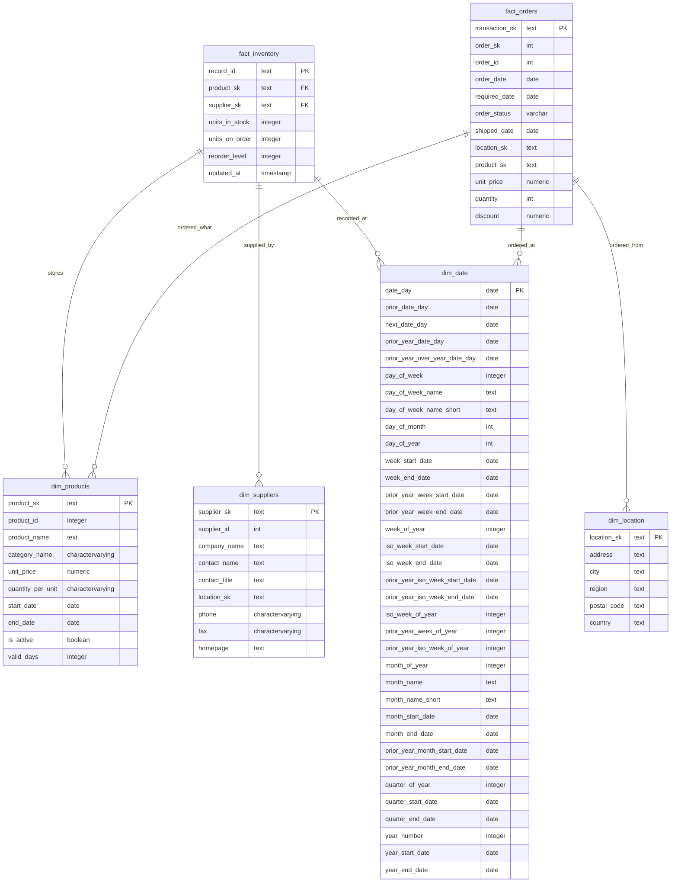

> **DISCLAIMER:** This project uses [northwind](https://docs.yugabyte.com/preview/sample-data/northwind/) as source data, which is a publicly avaiable dataset.  


-----


# 🤓 What is special about this?

- **Unit tests 📑**: Quality `data tests`, and `unit tests` to simulate business scenarious.            

- **Data Tests 📑**: Simple, but save these errors in a seperate table to curate them later.

- **Models Versioning ✨**: Two versioned models, `stg_inventory` and `fact_inventory`.

- **CI/CD 👾**: Initialize test-environment, build models, run models in `incremental_mode`, run `data tests`, and run `unit tests` in isolated environment before merging into `main` branch - using `Github Actions`.

- **Enforced Schema ✊**: Prevents unexpected `data quality` issues caused by changes in the source schema.

- **Slowly Chaning Dimension (SCD) type 2 🐢**: Products SCD but with old way.


# 🤔 Project Objectives
This project aims to craft a modern data warehouse solution that:
- 🤖 Track `orders` by `product`, `cateory` and `location`.  
- 🤖 Track `product price chaneges effect on orders`.
- 🤖 Track `Inventory` data to conduct Safety stock analysis in the future.


-----


# ERD

This is how I modeled the data—guided by **Ralph Kimball’s principles** in **The Data Warehouse Toolkit** 📖.




-----

# 🤯 Data Lineage


Notice that `fact_inventory` has two versions. The first version uses source **snapshots** as an upstream model for its pipeline. On the other hand, in the second version, I realized that the **snapshot** step was unnecessary, so we removed it, resulting in two new models: `stg_inventory.v2` and `fact_inventory.v2`.


-----

# 🏃 Run GitHub Workflow Offline Using act 🎬

With the help of the act tool, you can run and test your GitHub workflows locally using Docker. This allows you to catch issues before pushing changes to the remote repository.

> Check `.github/workflows`

To run a workflow locally and simulate a pull_request event, use the following command:

```sh
# Using act to run a GitHub workflow locally
# Secrets are stored in the .secrets file (create it yourself with required values)
act -P ubuntu-20.04=catthehacker/ubuntu:act-20.04 pull_request --secret-file .secrets --pull=false
```
- **act:** The CLI tool that simulates GitHub Actions workflows locally.

- **-P ubuntu-20.04=catthehacker/ubuntu:act-20.04:** Specifies the Docker image to use. We're using an Ubuntu 20.04 image provided by act.

- **pull_request:** Specifies the event type that will trigger the workflow.

- **--secret-file:** .secrets: Points to a file containing secret values for environment variables.

- **--pull=false**: Prevents act from automatically pulling the latest image (useful if you want to avoid an unnecessary download).

-----

# 📚 Resources
- [📑 dbt Unit Tests](https://docs.getdbt.com/docs/build/unit-tests)
- [🔧 dbt Model Versioning](https://docs.getdbt.com/docs/collaborate/govern/model-versions)
- [🔨 Test Driven Development (TDD) in Software Engineering](https://en.wikipedia.org/wiki/Test-driven_development)
- [🤔 Unit Tests 🆚 Integrations Tests](https://stackoverflow.com/questions/5357601/whats-the-difference-between-unit-tests-and-integration-tests)
- [🎬 act Documentation](https://nektosact.com/introduction.html)
